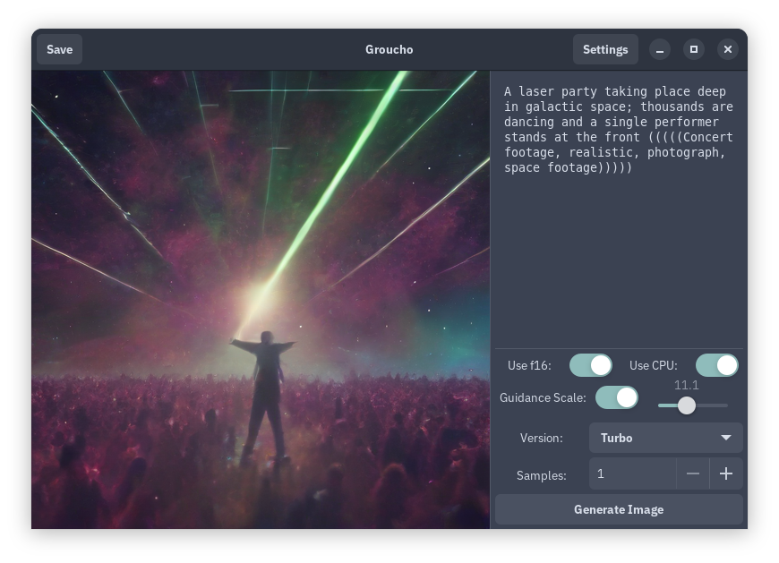

# groucho

A frontend for Huggingface's `candle` library, written in GTK for Linux desktop clients. 

## How it works

Everything is local. Generating your first image will automatically download the selected Stable Diffusion version to the `~/.cache/huggingface/hub/` folder. 

## Building

`nix run .` will build the project. 

Non-Nix systems will need the GTK depedencies. 